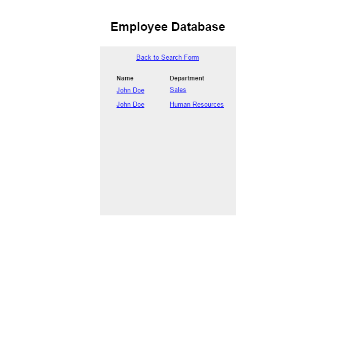
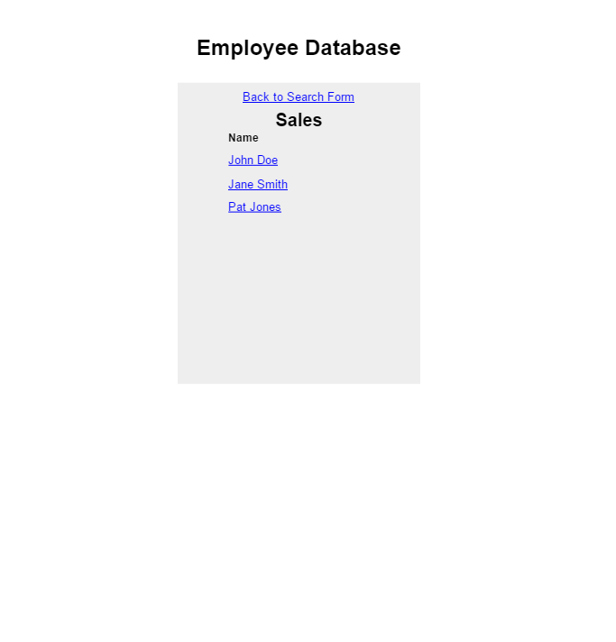
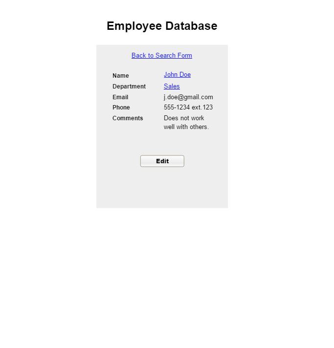

# Project Planning
For this assignment, you'll create some initial plans for your project.

## Assignment Description
[Project Planning Assignment](https://education.launchcode.org/liftoff/assignments/planning/)

## Submission Instructions

### Wireframes

(Include at least 3 wireframes here, adding images or files to your the repository as necessary. Format them as a bulleted/unordered list with links to the files.)

* 

* 

* 

* 

* 

* 

### Project Tracker

(Include a link to your public Pivotal Tracker project. Be sure you have user stories added for at least your first 2-week sprint.)

https://www.pivotaltracker.com/n/projects/2313493

### Project Repo Link

(Include a link to your project on GitHub)
